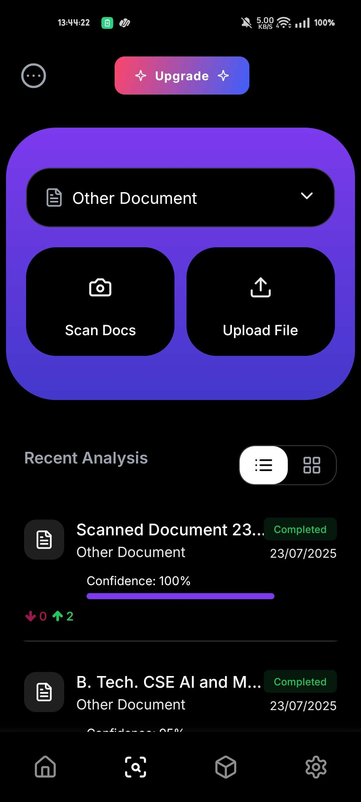
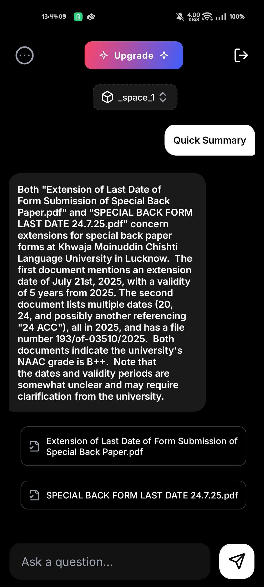
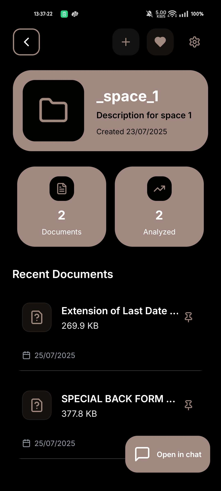

<div align="center">

# Saferead

### Understand what you sign. AI-powered legal document analysis for your pocket.

Upload terms of service, privacy policies, and legal agreements to get an AI breakdown of what you are actually agreeing to. No more skipping past the fine print.

<br />

<p align="center">
  
  
  
  
</p>

<br />

[](https://reactnative.dev/)
[](https://expo.dev/)
[](https://www.typescriptlang.org/)
[](https://github.com/pallavrai/saferead_backend)

[Features](#-features)  [Tech Stack](#-tech-stack)  [Getting Started](#-getting-started)  [Project Structure](#-project-structure)  [Screenshots](#-screenshots)

</div>

---

## Features

### Document Analysis

Upload documents as files or paste text directly. Saferead supports terms of service, privacy policies, legal agreements, and custom documents. Each document is analysed and given a confidence score along with a summary of risky and favourable points.

### AI Chat

Ask questions about your documents in natural language. The chat understands the context of your uploaded documents and can pull relevant clauses on demand.

### Spaces

Organise documents into spaces to keep personal, work, and other documents separate. Each space maintains its own chat history and document collection.

### Dashboard

Get an at-a-glance overview of your document library, including total documents, processing status, average confidence scores, and document type breakdowns.

### User Accounts

Register with an email and password or sign in with Google. Your documents and spaces are synced across devices.

### Premium Plans

Upgrade for additional features beyond the free tier.

---

## Tech Stack

### Mobile

- **Framework** -- [React Native](https://reactnative.dev/) 0.79 with [Expo](https://expo.dev/) SDK 53
- **Language** -- [TypeScript](https://www.typescriptlang.org/) 5.9
- **Navigation** -- [expo-router](https://docs.expo.dev/router/introduction/) (file-based routing)
- **State Management** -- [Zustand](https://zustand.docs.pmnd.rs/) (client state), [TanStack React Query](https://tanstack.com/query) (server state)
- **Forms** -- [React Hook Form](https://react-hook-form.com/) with [Zod](https://zod.dev/) validation
- **Animations** -- [React Native Reanimated](https://docs.swmansion.com/react-native-reanimated/)
- **Icons** -- [Lucide React Native](https://lucide.dev/)
- **HTTP Client** -- [Axios](https://axios-http.com/)

### Backend

- **Framework** -- [Django REST Framework](https://www.django-rest-framework.org/) 5.2
- **AI Analysis** -- Groq-powered LLM pipeline
- **Repository** -- [saferead_backend](https://github.com/pallavrai/saferead_backend)

---

## Getting Started

### Prerequisites

- Node.js 18 or later
- pnpm (recommended) or npm
- Expo CLI
- A physical device or emulator for iOS / Android
- Backend server running locally or remotely

### Quick Start

1. **Clone the repository**

   ```bash
   git clone https://github.com/your-username/saferead.git
   cd saferead
   ```

2. **Install dependencies**

   ```bash
   pnpm install
   ```

3. **Set up environment variables**

   ```bash
   cp sample.env .env
   ```

   Fill in the required values:

   | Variable                              | Description                    |
   | ------------------------------------- | ------------------------------ |
   | `EXPO_PUBLIC_API_URL`                 | Backend API base URL           |
   | `EXPO_PUBLIC_AI_API_KEY`             | API key for AI analysis        |
   | `EXPO_PUBLIC_STRIPE_PUBLISHABLE_KEY` | Stripe key for premium plans   |
   | `EXPO_PUBLIC_GOOGLE_CLIENT_ID_ANDROID`| Google Sign-In client ID      |
   | `EXPO_PUBLIC_GOOGLE_CLIENT_ID_IOS`   | Google Sign-In client ID       |

4. **Start the development server**

   ```bash
   pnpm dev
   ```

   Scan the QR code with the Expo Go app on your device, or press `a` for Android emulator / `i` for iOS simulator.

### Building for Production

```bash
# Web
pnpm build:web

# Android
pnpm android

# iOS
pnpm ios
```

### Available Scripts

| Command            | Description                         |
| ------------------ | ----------------------------------- |
| `pnpm dev`         | Start Expo development server       |
| `pnpm build:web`   | Export the app for web deployment   |
| `pnpm lint`        | Run ESLint across the codebase      |
| `pnpm format`      | Format code with Prettier           |
| `pnpm android`     | Build and run on Android            |
| `pnpm ios`         | Build and run on iOS                |

---

## Project Structure

```
saferead/
├── app/                  -- Expo Router screens (auth, tabs, modals)
├── components/           -- Reusable UI components
├── config/               -- App configuration (mutation cache, etc.)
├── constants/            -- Theme colours, fonts, server URL, filters
├── hooks/                -- Custom React hooks (auth, queries, animations, etc.)
├── services/             -- API client wrappers (document, space, conversation, plans)
├── store/                -- Zustand stores (user, documents, analysis, spaces, alerts)
├── types/                -- TypeScript type definitions
├── utils/                -- Helpers (API client, error handling, validation schemas)
├── assets/               -- Images, fonts, and other static resources
├── app.json              -- Expo configuration
├── tsconfig.json         -- TypeScript configuration
└── eas.json              -- EAS Build configuration
```

---

## Linting and Formatting

This project uses [ESLint](https://eslint.org/) with the Expo recommended configuration and [Prettier](https://prettier.io/) for code formatting.

```bash
pnpm lint
pnpm format
```

---

## Backend

The backend is a Django REST Framework application. You can find the source code and setup instructions at [pallavrai/saferead_backend](https://github.com/pallavrai/saferead_backend).

---

## License

[MIT](LICENSE)
